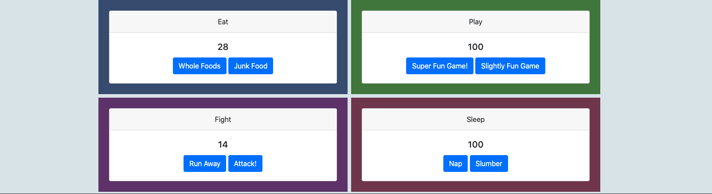

# Tamagachi Game
  This project utilizes fully modularized Javascript and super-clean code to emulates the basic functionality of the old Tamagotchi pet games!
### Link to your wireframes/prototype
  [Wireframe](https://www.figma.com/file/xQVIqxKHciXmO7HCejUzvz/Untitled?node-id=0%3A1)
### Link to the deployed project
  [Deployed Project](https://mg-tamagotchi-game.netlify.app/)
### Link to your project board
  [Project Board](https://github.com/GonzalesMatthew/ASSIGNMENT-Tamagotchi/projects/1)
### Description of the user
  For the lover of all things digital - especially pets!
### List of features                                                
  Interact with your digital pet: feed it, play with it, send it into battle, and put it to bed! Be a digital parent!
### Screenshots of your project

### List of contributors and links to their GH profiles
@GonzalesMatthew
### Link to Loom video walkthrough of your app
[App-Walkthrough Video](https://www.loom.com/share/f6579b22284348eab0a2810ae7bb1e8e)
